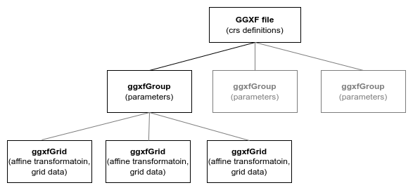

# GGXF NetCDF implementation

This document is to consider how best to implement the Geodetic Grid Exchange Format specification in a NetCDF file, and specifically which NetCDF features and conventions would best support usability and integrity of encoded geodetic data.

## 1. Overview of GGXF development

GGXF has been developed to provide a common format for encoding geodetic data such as geoid models, distortion grids, deformation models.  Each of these is distributed in an number of formats, commonly devised by the agency publishing the data.  The intention of GGXF is to define a common structure and formats for encoding these data sets.  Most such data sets are published to support coordinate and datum conversions.

GGXF will provide both an text format to support creation and a binary format for publication and use.

The common feature of GGXF datasets is that they define one or more parameters on a spatial surface as a function of position by interpolating from values defined at nodes of a spatial grid.

Development has proceeded in five stages:

1. Definition of user requirements
2. Definition of the logical model and attributes required
3. Construction of example data sets (which adopted the YAML text format)
4. Implementing a proof of concept NetCDF implementation to confirm it as a viable binary format
5. __Refinement of the NetCDF format__

The current phase is considering how adopting NetCDF conventions could improve usability or uptake of GGXF.

## 2. Logical data structure

The diagram below illustrates the high level structure of a GGXF data set.

The main components are:

* GGXF file header.  Defines common attributes and metatdata, including the interpolation CRS, and usually a source and target CRS.  
* GGXF group.  A data set may contain one or more groups.  Each group may define a different set of parameters. For example a deformaton model data set may include a group defining vertical offsets due to glacial isostatic adjustment and another representing east and north offsets due to tectonic deformation.  The group header defines the parameters defined by the group
* GGXF grid.  Contains the grid data as a (r,c,p) dimensioned arrays, where r and c are the number of spatial rows and columns, and p is the number of parameters defined by the group.  A group may contain multiple grids, but only one is used to evaluate the group at any one location.  Commonly the grids form a nested structure, with finer grids where the data set requires more detail.  Logically they represent a single large grid - using multiple grids is a size and calculation optimisation.  Each GGXF grid defines an affine transformation that maps the grid row and column indices to the interpolation CRS coordinates.

The GGXF github repository contains a number of [example datasets](https://github.com/opengeospatial/CRS-Gridded-Geodetic-data-eXchange-Format/tree/master/examples).  

Most geodetic dataset types only require one group (and many only one grid).  In the deformation model example GGXF groups define elements of the deformation model with different time behaviours.  These are summed at given location and time to define the total displacement.

## 3. NetCDF prototype

The NetCDF prototype was constructed by Chris Crook to prove NetCDF was a viable carrier for GGXF.  It was constructed using the [NetCDF python API](https://unidata.github.io/netcdf4-python/) following the [NetCDF data model](https://docs.unidata.ucar.edu/netcdf-c/current/netcdf_data_model.html#enhanced_model), but with little knowledge of NetCDF conventional usage.  It maps the YAML definition to a NetCDF format with minimal modification.  

The mapping of GGXF elements to NetCDF is as follows

| GGXF | NetCDF
| --- | --- |
| GGXF file | Root NetCDF group
| ggxfGroup | Child group of NetCDF root group
| ggxfGrid  | Child group of ggxfGroup group
| Attributes | NetCDF attribute.  Attributes defining array dimensions are defined as NetCDF dimensions.  Attributes are all scalar values except the affine transformation coefficients which are an array of float values.
| Grid data | A single NetCDF variable called "data" in the GGXF grid group.

Structured attributes in the GGXF header such as contentApplicabilityExtent were flattened to linear structures using a "dot notation" to name nested attributes, eg "contentApplicabilityExtent.boundingBox.southBoundLatitude".

One GGXF change made as a result of this implementation was implement nesting of ggxfGrids using YAML and NetCDF structures rather than defining by child/parent attributes.  So a ggxfGrid group may contain child ggxfGrid groups.

The prototype provides:

* conversion between YAML and NetCDF formats
* evaluation of the GGXF function at a location and time
* some validation of GGXF structure in YAML/NetCDF

Resources on the prototype:

* [Python source code](https://github.com/opengeospatial/CRS-Gridded-Geodetic-data-eXchange-Format/tree/master/scripts/GGXF)
* [Github issue describing some implementation choices](https://github.com/opengeospatial/CRS-Gridded-Geodetic-data-eXchange-Format/issues/17)

Example CDL (headers only):

* [geoid model](https://github.com/opengeospatial/CRS-Gridded-Geodetic-data-eXchange-Format/blob/master/examples/geoid/noaa/PRGEOID18a-header.cdl) - single group, single grid
* [ntv2 distortion model](https://github.com/opengeospatial/CRS-Gridded-Geodetic-data-eXchange-Format/blob/master/examples/ntv2/ca_ntv2/ca_ntv2-header.cdl) - single group, multiple grids
* [deformation model](https://github.com/opengeospatial/CRS-Gridded-Geodetic-data-eXchange-Format/blob/master/examples/deformation/nzgd2000/nzgd2000-20180701-header.cdl) - multiple groups, multiple grids.

## 4. NetCDF refinement opportunities

Martin Desriusseaux [reviewed the prototype implementation](https://github.com/opengeospatial/CRS-Gridded-Geodetic-data-eXchange-Format/issues/28) and noted a number opportunities to better align the implementation with conventional NetCDF practice.  

Adopting these could potentially improve GGXF utility (compatibility with existing tools) and uptake (developer familiarity).  This has been the subject of extensive discussion, as evidenced by the github issue.  

The following summarises the main aspects of this discussion.

### 4.1. Using NetCDF variable names rather than grid indices to identify parameters

The YAML and prototype using array indexing to identify parameters.  The ggxfGrid contains a variable "data", an array dimensioned (c,r,p) in which the last dimension is the number the parameters.  Its parent ggxfGroup defines an ordered list of parameters in its grids, e.g.[offsetEast, offsetNorth] which implicitly defines the array index for each parameter.  

The proposal is that the ggxfGrid contains variables named according to the parameter they contain.  In the example above the ggxfGrid would contain NetCDF variables called "offsetEast", "offsetNorth", each an array of dimension (c,r).

Pros:

Cons:

#### 4.1.1. Using vector parameters

The GGXF specfication flattens vector parameters such as "offset" to scalar values "offsetEast", "offsetNorth".  These are better represented as arrays of vector data in NetCDF.  For example a horizontal offset is defined by a NetCDF variable "offset" or dimension (c,r,2).  Another example is an NtV2 file which defines 2 dimensional offset and uncertainty at each node.  This would have two NetCDF variables in each ggxfGrid called "offset" and "offsetUncertainty".

Pros:

Cons:

#### 4.1.2. Definition of axis order for vector parameters

Note: this is the most contentious issue in dissusion of NetCDF implementation

If GGXF adopts vector parameters such as offset then the axis order n the parameter must be defined (ie \[east,north] or \[north,east]).  There are (at least) three options for how this is defined:

* define in the GGXF specification
* explicitly define by an attribute in the ggxfGroup or ggxfGrid, eg "axisOrder": ["north","east"]
* (where the GGXF is a transformation between source and target CRS) define the order to be the same as the axis order of the source or target CRS.  Where the grid applies to a subset axes (eg deformation group with just horizontal deformation) define by an index array to the CRS axes (see [deformation example proposal](https://github.com/opengeospatial/CRS-Gridded-Geodetic-data-eXchange-Format/wiki/NetcdfExamplesLayout2#deformation-model))

An [alternative proposal](https://github.com/opengeospatial/CRS-Gridded-Geodetic-data-eXchange-Format/wiki/DataStructure#layout-3-authoritative-grid-metadata-in-ggxf-header) is that the GGXF doesn't specify the NetCDF vector parameters at all.  Instead the are defined in the individual NetCDF file by a mapping of the GGXF scalar parameter names.  That is, the NetCDF group defining the ggxfGroup defines a mapping such as "offset": ["offsetEast","offsetNorth"] which implies that the ggxfGrid will contain a vector variable called "offset" holding the GGXF parameters offsetEast, offsetNorth.

### 4.2. Variable attributes for units

Currently GGXF defines the units of parameters as attributes in the ggxfGroup (though there is a [proposal they should be in the GGXF file header](https://github.com/opengeospatial/CRS-Gridded-Geodetic-data-eXchange-Format/issues/30)).

A more conventional NetCDF implementation would define units as a parameter of the variable containing the grid data ([see example for geoid](https://github.com/opengeospatial/CRS-Gridded-Geodetic-data-eXchange-Format/wiki/NetcdfExamplesLayout2#geoid-model))

Pros:

Cons:

### 4.3. ACDD conventions for attribute names

(Note: this is a recent suggestion and has not been reviewed by the team yet)

In the last revision of the proposed structure Martin has suggested GGXF consider the [ACDD conventions for attribute names](https://wiki.esipfed.org/Attribute_Convention_for_Data_Discovery_1-3#Global_Attributes).  This might improve discoverability in some communities.

This would make some changes to the list of attributes supported, would convert attributes from CamelCase to snake_case, and would flatten data structures such as contentApplicabilityExtent.

Pros:

Cons:
